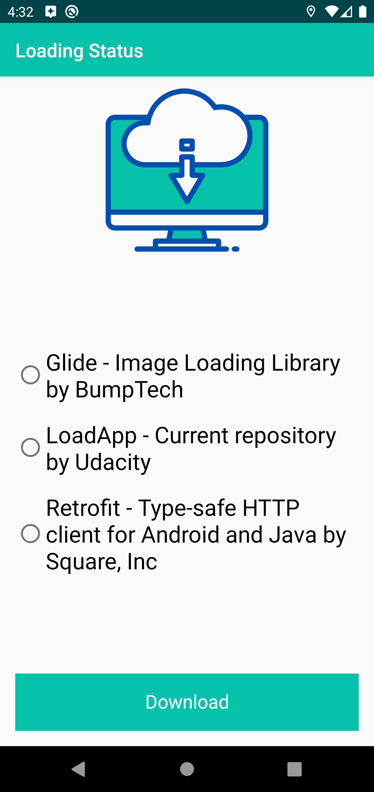
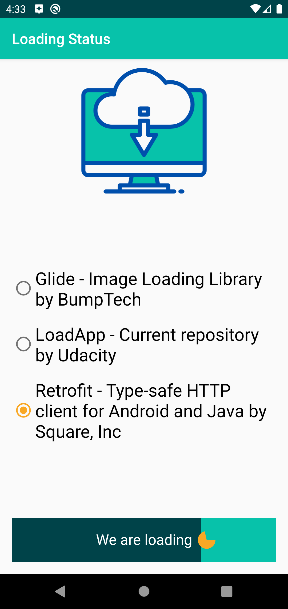
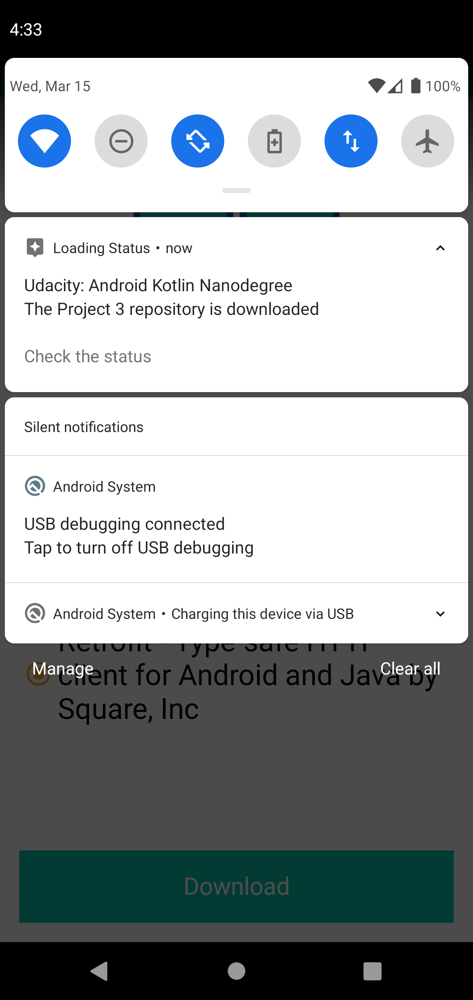
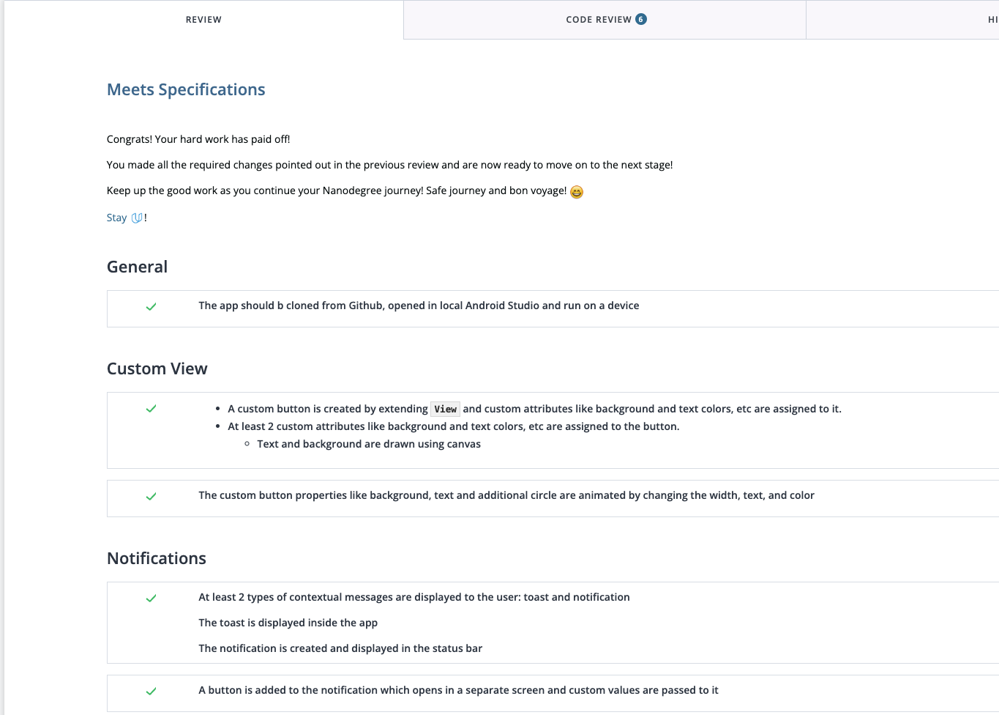

# Application Loading Status Bar

In this project students will create an app to download a file from Internet by clicking on a custom-built button where:
- width of the button gets animated from left to right;
- text gets changed based on different states of the button;
- circle gets be animated from 0 to 360 degrees

|Home|Customised Button|Download|
|--|-------------|---|
||||


## Getting Started

Instructions for how to get a copy of the project running on your local machine.

### Dependencies

```
    implementation fileTree(dir: 'libs', include: ['*.jar'])
    implementation "org.jetbrains.kotlin:kotlin-stdlib-jdk7:$kotlin_version"
    implementation 'androidx.appcompat:appcompat:1.0.2'
    implementation 'androidx.core:core-ktx:1.0.2'
    testImplementation 'junit:junit:4.12'
    androidTestImplementation 'androidx.test:runner:1.1.1'
    androidTestImplementation 'androidx.test.espresso:espresso-core:3.1.1'
```

### Installation

Step by step explanation of how to get a dev environment running.

List out the steps:

```
1. Open Android Studio Application
2. Choose "Open an existing Android Studio Project"
3. In the opened finder find `nd940-c3-advanced-android-programming-project-starter` folder
4. Click on the folder and select `starter` folder and click on "Open" button
5. Once the project is opened in Android studio, go to File -> Sync Project with gradle files
6. Click on "Run" button in Android Studio to install the project on the phone or emulator
```

## Testing

Explain the steps needed to run any automated tests

### Break Down Tests

Explain what each test does and why

```
Examples here
```
## Project Instructions

This section should contain all the student deliverables for this project.

## Built With

* [Android Studio](https://developer.android.com/studio) - Default IDE used to build android apps
* [Kotlin](https://kotlinlang.org/) - Default language used to build this project

---

## Review from the Reviewer (Udacity)



---

## License

```
Copyright 2023

Licensed under the Apache License, Version 2.0 (the "License"); 
you may not use this file except in compliance with the License. 
You may obtain a copy of the License at

   http://www.apache.org/licenses/LICENSE-2.0
   
Unless required by applicable law or agreed to in writing, software
distributed under the License is distributed on an "AS IS" BASIS,
WITHOUT WARRANTIES OR CONDITIONS OF ANY KIND, either express or implied.
See the License for the specific language governing permissions and
limitations under the License.
```
